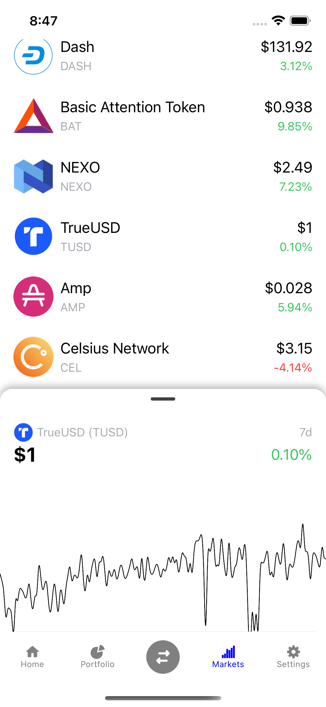

# Thelpis Wallet.

What is the future of finance? This question is addressed through the focus on cryptocurrencies and decentralized finance.
The purpose of this applied capstone project is to demonstrate the capabilities of cryptocurrencies and the potential to alleviate poverty in Africa
through financial inclusion using cryptocurrencies. This project draws on interviews, observations, and conversations with users who are already in the crypto space and those who aspire to be.
It also draws on personal experiences with existing wallets and the challenges faced in those spaces.
The project scope is limited to the sending, receiving, and storing of cryptocurrencies and does not focus on buying and selling since implementing payment gateways in Web 3.0 decentralized apps is complex and requires a lot of resources and funding. The result is a secure non-custodial cryptocurrency wallet named Thelpis that allows users to send, receive, and store cryptocurrencies.
We conclude that the functional requirements for Thelpis are feasible within the scope of this applied capstone project, and we build the platform over the proposed project timeline.

  
   
  

  
   
     

